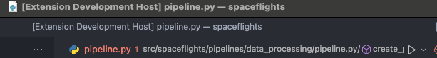

# Requirements

1. VS Code 1.64.0 or greater
2. Python 3.8 or greater
3. node >= 18.17.0
4. npm >= 8.19.0 (npm is installed with node, check npm version, use npm install -g npm@8.3.0 to update)
5. Python and YAML (RedHat) extension for VS Code
6. Create a new kedro project with pipelines kedro new

 # Dev Setup
 1. `npm install`
 2. `pip install -r requirements.txt` in `vscode-kedro`
 3. `pip install -r requirements.txt` in the test project (to make sure you can do `kedro run`)
 4. `make sign-off` to make sure the DCO will pass.

# Debug
You can start debug with `F5`, this should lauch an "Extension Development Host". If it doesn't check if there is a process stuck in the terminal, try to hit `Cmd + C` or `Ctrl + C` to terminate the `npm watch` process.

Once you have the extension host launched, you can start putting breakpoint in `lsp_server.py` to start development.
