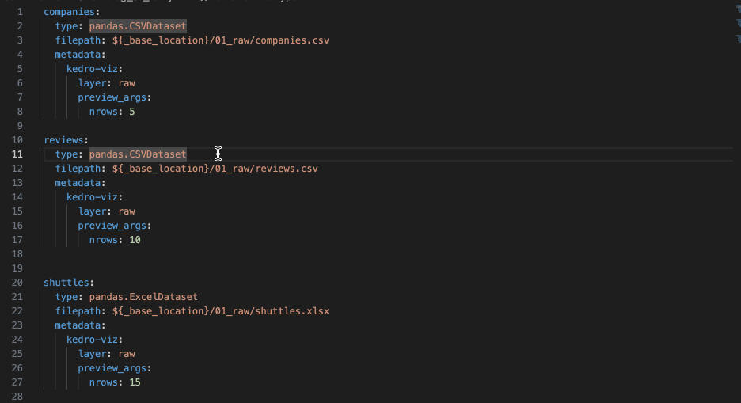

# vscode-kedro
The extension is in beta, so you may experience breaking changes and bugs. If you encounter issue, report it in [Github](https://github.com/kedro-org/vscode-kedro/issues) or [Slack](https://slack.kedro.org), we will try to fix ASAP.


## Requirements
1. VS Code 1.64.0 or greater
2. Python extension for VS Code
3. Kedro Project >= 0.19

## How to use this extension
1. Install `Kedro` from the extension
2. Select the correct Python interpreter that you use to run the Kedro project with the `> Python: select interpreter` command

p.s. If you can `kedro run` with the environment, you are good to go.

The extension requires `bootstrap_project` in Kedro, you need to make sure you can do `kedro run` without getting any immediate error, otherwise you may get a server panic error.

## How to restart a server if there are error
Click `Output` and select `Kedro` from the dropdown list. It may gives you some hints and report back if you think this is a bug.

Hit `Cmd` + `Shift` + `P` to open the VSCode command, look for `kedro: restart server` in case it's panic.

## Assumptions
### Configuration Source
Currently, the extension assume the source of configuration is `conf/base`. If you have customised `CONF_SOURCE` in project settings, certain features will not be functional properly.

### Configuration Environment
The extension assumes `base` environment. However, you may want it to use different environments. This is still WIP.

### Pipeline Discovery
The extension follows Kedro [pipeline autodiscovery mechanism](https://docs.kedro.org/en/stable/nodes_and_pipelines/pipeline_registry.html#pipeline-autodiscovery). It means that in general it is looking for modular pipelines structure, i.e. `<src/package/pipelines/<pipeline>`. It can be visualised as follows:
```
.
├── conf
│   ├── base
│   └── local
├── notebooks
├── src
│   └── demo
│       ├── pipelines
│           ├── first_pipeline
│           └── second_pipeline


# Feature
## Go to Definition from pipeline.py to configuration files
Use `Cmd` (Mac)/ `Ctrl` (Window) + `Click` or `F12` to trigger `Go to Definition`


## Go to Reference from configuration files to pipeline.py
- `Cmd` or `Ctrl` (Window) + `Click` on the definition.
- Use `Find Reference`
- Use the shortcut `Shift` + `F12`


**Note:** You can find pipeline reference in all the files containing "pipeline" in their names, even in nested subdirectories. 
```
- pipelines
  - sub_pipeline
    - pipeline_data_processing.py
    - sub_pipeline_1
        - pipeline_data_processing_1.py
```

## Autocompletion in Python
Type `"` in any `pipeline.py` and it should trigger the autocompletion list.


## Schema Validation


## Hover
Just hover your mouse over any `params:` or hit the command `Show or Focus Hover`

