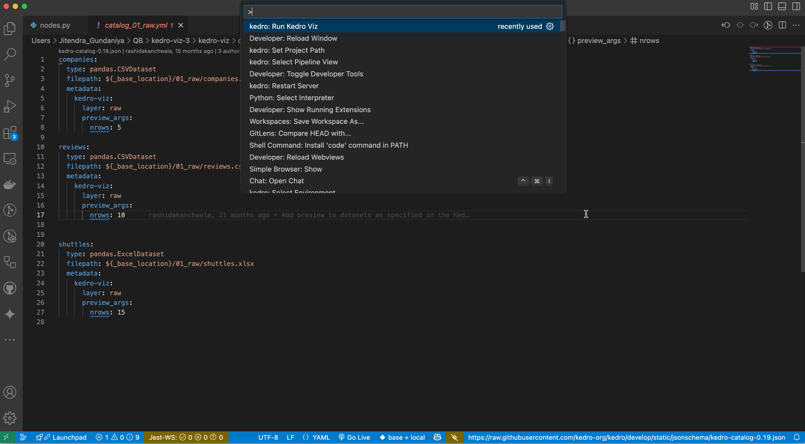

# vscode-kedro
The extension integrates [Kedro](https://github.com/kedro-org/kedro) projects with Visual Studio Code, providing features like enhanced code navigation and autocompletion for seamless development.

If you encounter issue, report it in [Github](https://github.com/kedro-org/vscode-kedro/issues) or [Slack](https://slack.kedro.org), we will try to fix ASAP.

- [vscode-kedro](#vscode-kedro)
  - [Requirements](#requirements)
  - [How to use this extension](#how-to-use-this-extension)
- [Feature](#feature)
  - [Go to Definition from pipeline.py to configuration files](#go-to-definition-from-pipelinepy-to-configuration-files)
  - [Go to Reference from configuration files to pipeline.py](#go-to-reference-from-configuration-files-to-pipelinepy)
  - [Autocompletion in Python](#autocompletion-in-python)
  - [Schema Validation](#schema-validation)
  - [Hover](#hover)
  - [To navigate between the flowchart and the code editor in Kedro-Viz:](#to-navigate-between-the-flowchart-and-the-code-editor-in-kedro-viz)
  - [Settings](#settings)
    - [Change Configuration Environment](#change-configuration-environment)
  - [How to restart a server if there are error](#how-to-restart-a-server-if-there-are-error)
  - [Assumptions](#assumptions)
    - [Single Kedro Project](#single-kedro-project)
    - [Configure Kedro Environment](#configure-kedro-environment)
    - [Pipeline Discovery](#pipeline-discovery)
  - [Visualisation with Kedro-Viz](#visualisation-with-kedro-viz)
  - [Troubleshooting](#troubleshooting)

## Requirements
1. VS Code 1.64.0 or greater
2. Python extension for VS Code
3. Kedro Project >= 0.19

## How to use this extension
1. Install `Kedro` from the extension
2. Select the correct Python interpreter that you use to run the Kedro project with the `> Python: select interpreter` command
3. Open your VSCode workspace at the root of the Kedro project.

p.s. If you can `kedro run` with the environment, you are good to go.

The extension requires `bootstrap_project` in Kedro, you need to make sure you can do `kedro run` without getting any immediate error, otherwise you may get a server panic error.


# Feature
## Go to Definition from pipeline.py to configuration files
Use `Cmd` (Mac)/ `Ctrl` (Window) + `Click` or `F12` to trigger `Go to Definition`


## Go to Reference from configuration files to pipeline.py
- `Cmd` or `Ctrl` (Window) + `Click` on the definition.
- Use `Find Reference`
- Use the shortcut `Shift` + `F12`


**Note:** You can find pipeline reference in all the python files under `<package_name>/pipelines`
```
- pipelines
  - sub_pipeline
    - pipeline_data_processing.py
    - sub_pipeline_1
        - pipeline_data_processing_1.py
```

## Autocompletion in Python
Type `"` in any `pipeline.py` and it should trigger the autocompletion list.


## Schema Validation


## Hover
Just hover your mouse over any `params:`, datasets or hit the command `Show or Focus Hover`


## To navigate between the flowchart and the code editor with Kedro-Viz:
To visualize your Kedro project using Kedro-Viz in Visual Studio Code, follow these steps:

1. **Open the Command Palette**:
Press `Cmd` + `Shift` + `P` (on macOS) or `Ctrl` + `Shift` + `P` (on Windows/Linux).

2. **Run Kedro-Viz**:
Type `kedro: Run Kedro Viz` and select the command.
This will launch Kedro-Viz and display your pipeline visually within the extension.

**Note:** To update the Kedro-Viz flowchart after making any changes to your Kedro project, please hit `Cmd` + `Shift` + `P` to open the VSCode command and look for `kedro: restart server`.

Navigate to Node Functions:
Click on a node in the Kedro-Viz flowchart, and it will automatically navigate to the corresponding node function in your code.


Navigate to DataCatalog:
Clicking on a data node in the flowchart will open the corresponding dataset in the Data Catalog.


### Filter Pipelines

#### Using the Command Palette

1. Open the Command Palette by pressing `Cmd + Shift + P` (macOS) or `Ctrl + Shift + P` (Windows/Linux)
2. Type `Kedro: Select Pipeline View` and select it
3. Once you run that command, Select the pipeline you want to filter by


#### Using the filter icon

1. Open VS Code settings by pressing `Cmd + ,` (macOS) or `Ctrl + ,` (Windows/Linux)
2. Type `Kedro: Run Kedro Viz` and select the command to launch the Viz
3. In the Kedro-Viz panel, click the filter icon
4. Select the pipeline you want to filter by


### Collapse and expand pipeline

1. Open VS Code settings by pressing `Cmd + ,` (macOS) or `Ctrl + ,` (Windows/Linux)
2. Type `Kedro: Run Kedro Viz` and select the command to launch the Viz
3. In the Kedro-Viz panel, click the collapse/expand icon


### Set Custom Kedro Project Path

You can specify a custom path to your Kedro project root directory in one of two ways:

1. **Using the Command Palette**:
   - Press `Cmd` + `Shift` + `P` (on macOS) or `Ctrl` + `Shift` + `P` (on Windows/Linux)
   - Type and select `Kedro: Set Project Path`
   - Enter the absolute path to your Kedro project root directory
   - The extension will validate if it's a valid Kedro project by checking for `pyproject.toml`

2. **Using Settings**:
   - Open VS Code Settings (File > Preferences > Settings)
   - Search for "Kedro Project Path"
   - Enter the absolute path to your Kedro project root directory in the `kedro.kedroProjectPath` setting

The extension will:
- Validate that the provided path contains a valid Kedro project
- Add the project folder to your workspace if it's not already included
- Use this path as the root directory for all Kedro-related features

**Note:** The project path must point to a directory containing a valid Kedro project with a `pyproject.toml` file that includes the `[tool.kedro]` section.

Example:
```
{
    "kedro.kedroProjectPath": "/absolute/path/to/your/kedro-project"
}
```


## Settings
### Change Configuration Environment
By default, the extension references the configuration loader's base_env (typically `base`). To change the directory where the extension looks for configurations, the extension provides 3 different ways to do this:

1. Click on the Kedro Icon in the status bar (bottom right)
 
2. Use Command (`Cmd` + `Shift` + `P`) and choose `kedro: Select Environment`
3. [Change default environment](assets/settings_environment.png)


## How to restart a server if there are error
Click `Output` and select `Kedro` from the dropdown list. It may gives you some hints and report back if you think this is a bug.

Hit `Cmd` + `Shift` + `P` to open the VSCode command, look for `kedro: restart server` in case it's panic.

## Assumptions

### Configure Kedro Environment
Currently, the extension assume the source of configuration is in the `base_env` defined by the config loader (if you didn't speficy, [usually it is `conf/base`](https://docs.kedro.org/en/stable/configuration/configuration_basics.html#configuration-loading)).

This mean that if the configuration is overrided by the `default_run_env`(usually it is `local`), the extension may fails to resolve to the correct location.

### Pipeline Discovery
The extension follows Kedro [pipeline autodiscovery mechanism](https://docs.kedro.org/en/stable/nodes_and_pipelines/pipeline_registry.html#pipeline-autodiscovery). It means that in general it is looking for modular pipelines structure, i.e. `<src/package/pipelines/<pipeline>`. It can be visualised as follows:
```
.
├── conf
│   ├── base
│   └── local
├── notebooks
├── src
│   └── demo
│       ├── pipelines
│           ├── first_pipeline
│           └── second_pipeline

```

## Troubleshooting
In VSCode, you can check the `Output` tab next to your terminal and select `Kedro` to read the logs.

You can either run the `Kedro: Show logs` command or click `Output` and select `Kedro` from the dropdown list. It may gives you some hints and report back if you think this is a bug.
