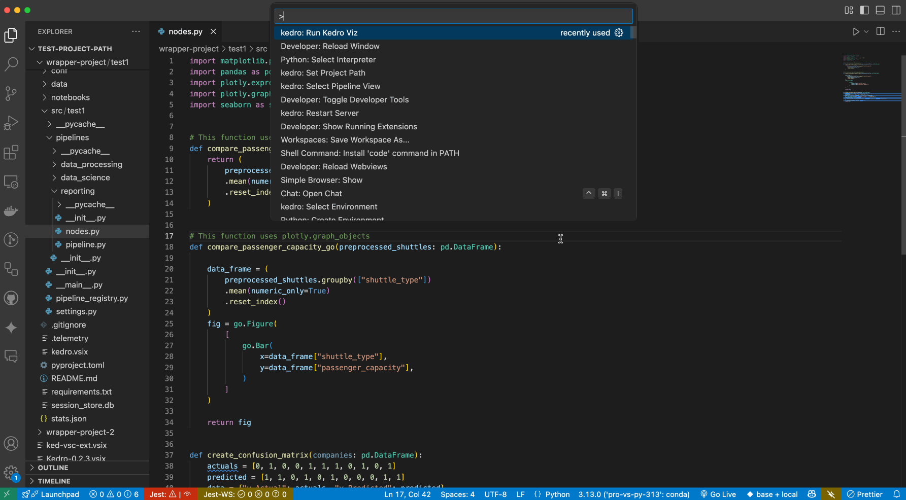
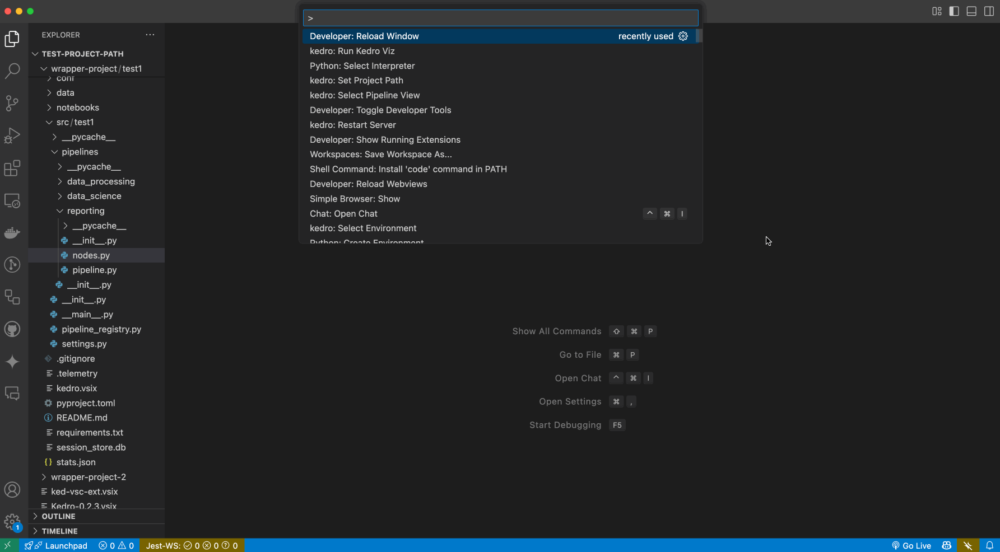

# Install dependencies and run Kedro-Viz

**Note:** For Kedro VS Code extension to work, please open a `.py` or `.yaml` file.

### 5.1 Run Kedro Viz
   - Press `Cmd` + `Shift` + `P` (on macOS) or `Ctrl` + `Shift` + `P` (on Windows/Linux)
   - Type and select `Kedro: Run Kedro Viz`

#### P.S.: If you don't have Kedro-Viz 11.0.0 or later, you will be prompted to install or update it.

