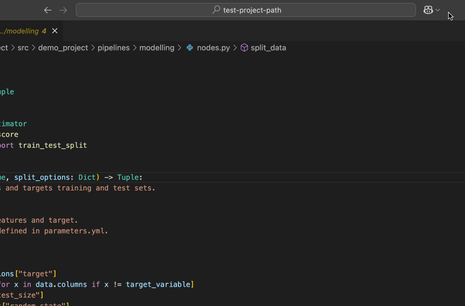
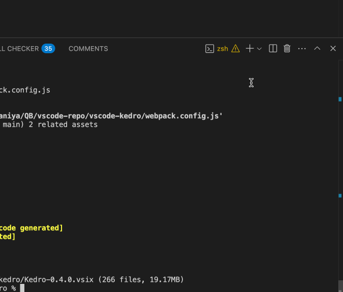

# Select the correct Python interpreter

### Make sure to select the interpreter that has Kedro and the necessary Kedro project dependencies installed.

### After selecting the interpreter, verify by looking for the orange warning icon as shown below. If you see a similar warning, please relaunch the terminal.

