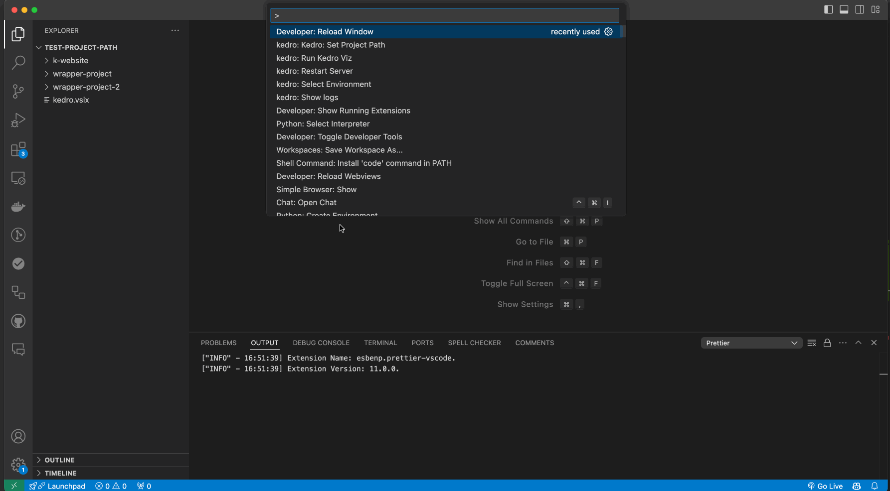

# Set Custom Kedro Project Path

### 4.1 Specify a custom path to your Kedro project root directory

1. **Option 1: Using the Command Palette**:
   - Press `Cmd` + `Shift` + `P` (on macOS) or `Ctrl` + `Shift` + `P` (on Windows/Linux)
   - Type and select `Kedro: Set Project Path`
   - Enter the absolute path to your Kedro project root directory
   - The extension will validate if it's a valid Kedro project by checking for `pyproject.toml`

2. **Option 2: Using Settings**:
   - Open VS Code Settings (File > Preferences > Settings)
   - Search for "Kedro Project Path"
   - Enter the absolute path to your Kedro project root directory in the `kedro.kedroProjectPath` setting

### 4.2 How to get the absolute path of your Kedro project

   - Press `Cmd` + `Shift` + `E` (on macOS) or `Ctrl` + `Shift` + `E` (on Windows/Linux) to open VSCode explorer
   - Locate your Kedro project folder
   - Right click on it and select `Copy path`

**Note:** This step is applicable to those who have their kedro project not at the root directory or they have multiple kedro projects.

